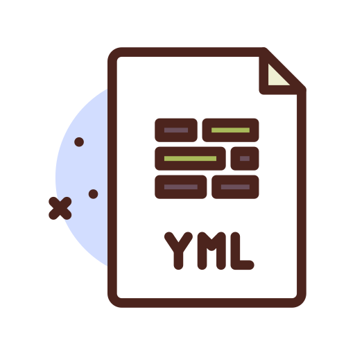
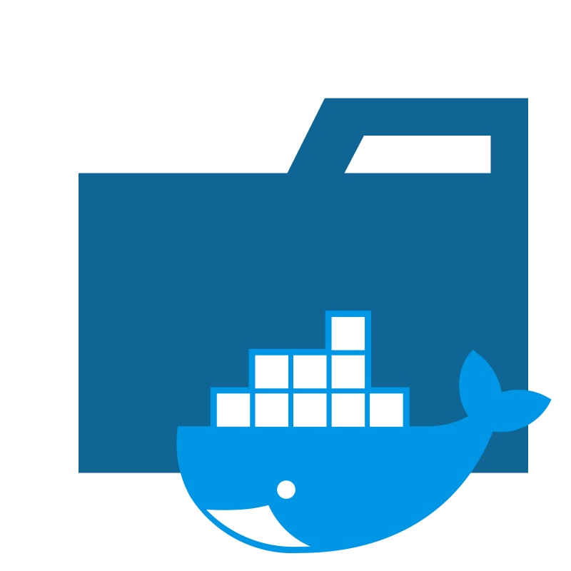

  

<table>
    <tr>
        <td></td>
        <td style="line-height:17px">
        
Docker

        
Docker es una herramienta diseñada para facilitar la creación, implementación y ejecución de aplicaciones mediante el uso de contenedores.Docker es una herramienta diseñada para facilitar la creación, implementación y ejecución de aplicaciones mediante el uso de contenedores.
</td>
    </tr>
    <tr>
        <td></td>
        <td style="line-height:17px">
        
Container - ContenedorContainer - Contenedor

        
Es una instancia de una imagen ejecutándose en un ambiente aislado..
</td>
    </tr>
    <tr>
        <td></td>
        <td style="line-height:17px">
        
Image - Imagen de contenedor

        
Es un archivo construido por capas, que contiene todas las dependencias para ejecutarse, tal como: las dependencias, configuraciones, scripts, archivos binarios, etc.
</td>
    </tr>
    <tr>
        <td></td>
        <td style="line-height:17px">
        
Dockerizar una aplicación

        
Proceso de tomar un código fuente y generar una imagen lista para montar y correrla en un contenedor.
</td>
    </tr>
    <tr>
        <td></td>
        <td style="line-height:17px">
        
Dockerfile

        
Un archivo de texto con instrucciones necesarias para crear una imagen. Se puede ver como un blueprint o plano para su construcción.
</td>
    </tr>
    <tr>
        <td></td>
        <td style="line-height:17px">
        
.dockerignore (archivo)

        
Similar al .gitignore, el .dockerignore especifica todo lo que hay que ignorar en un proceso de construcción (build)
</td>
    </tr>
    <tr>
        <td></td>
        <td style="line-height:17px">
        
docker-compose.yml

        
Archivo para definir los servicios y con un solo comando en lugar de definir todo directamente en la consola.
</td>
    </tr>
    <tr>
        <td></td>
        <td style="line-height:17px">
        
Volumes - Volúmenes

        
Proporcionan la capacidad de conectar rutas específicas del sistema de archivos del contenedor a la máquina host. 

        
Si se monta un directorio en el contenedor, los cambios en ese directorio también se ven en la máquina host.

        </td>
    </tr>

</table>